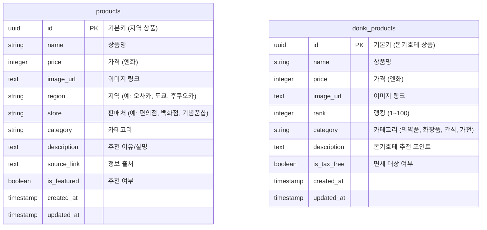

# 4. Database Design (데이터베이스 설계)

## 4.1 ERD (Entity Relationship Diagram)

## 4.2 설계 원칙
- **Separation of Concerns (관심사의 분리):**
    - `products`는 '지역성(Locality)'에 집중하여, 특정 지역 여행 시에만 살 수 있는 아이템 위주로 구성합니다.
    - `donki_products`는 '보편성(Universality)'에 집중하여, 일본 전역 돈키호테 어디서나 살 수 있는 필수템 위주로 구성합니다.
- **Images:** 외부 링크를 저장하되, 깨짐 방지를 위해 추후 Supabase Storage 저장 고려.